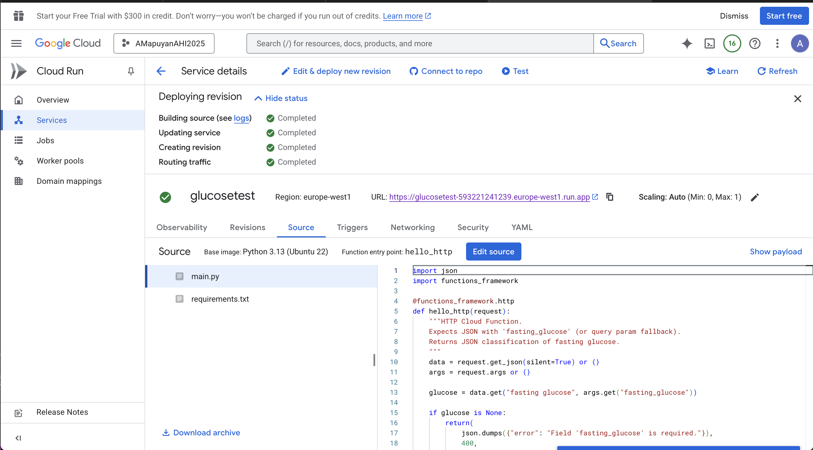
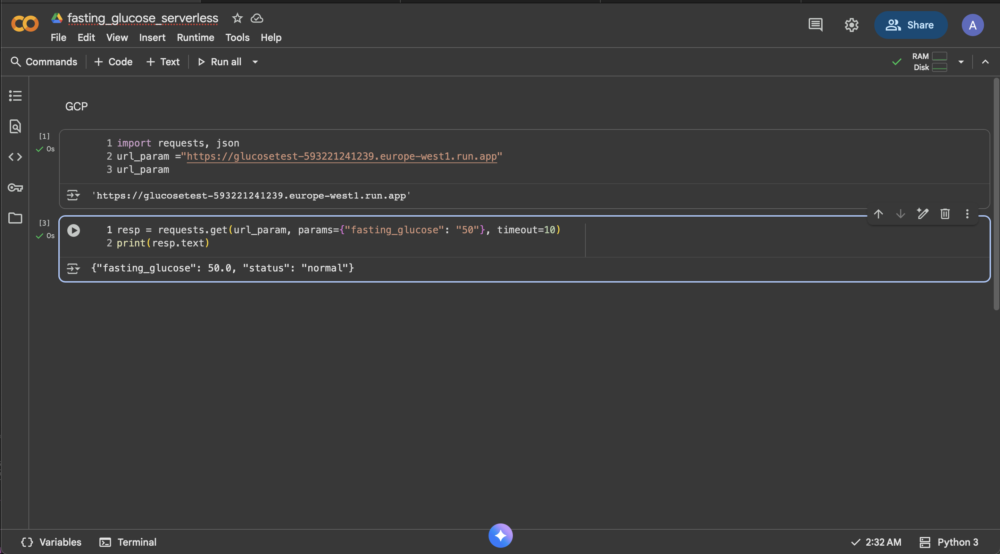
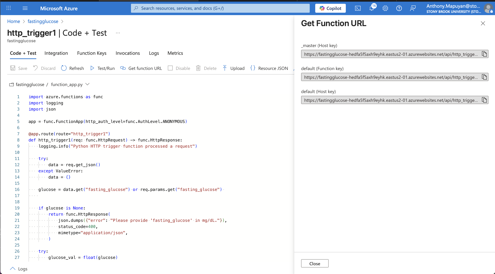
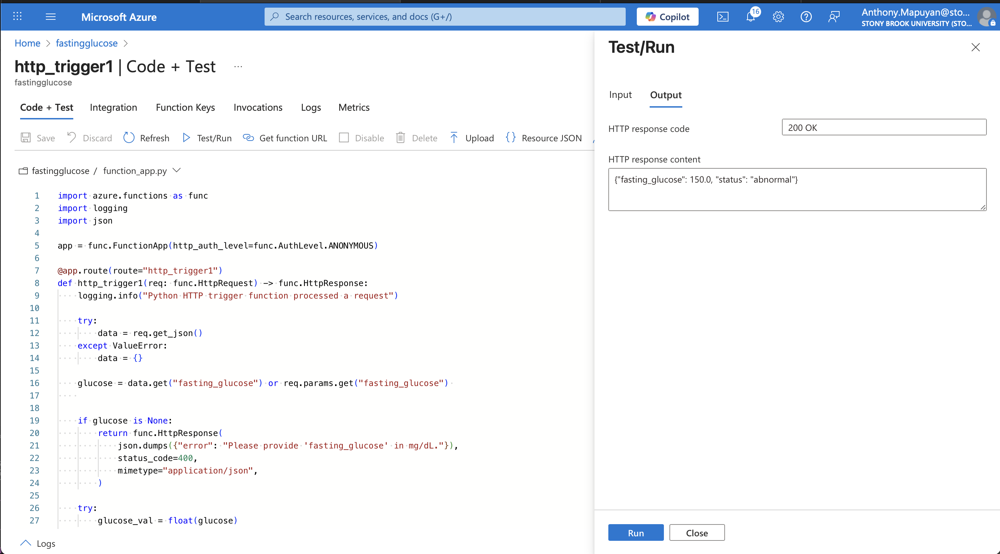

# 504_serverless_functions
[Recording]

## Explanation
- 
Source: (https://diabetes.org/about-diabetes/diagnosis?utm_source=chatgpt.com)

## Google Cloud Platform
Region: Europe-west1

Endpoint URL: https://glucosetest-593221241239.europe-west1.run.app

## Custom URL / Successful Deployment

## Example Requests
Normal:

Abnormal:

## Azure
Region: East-US 2

Endpoint URL: https://fastingglucose-hedfa5f5axh9eyhk.eastus2-01.azurewebsites.net/api/http_trigger1?code=MEtYpMkNkwhBaOd0AA_Gz7GC7BRYOeSh5BaNvKjRtOxvAzFu2KgFaw==

## Custom URL / Successful Deployment

## Example Requests
Normal:

Abnormal:

## Comparison
I found working with Google Cloud Platform (GCP) to be a smoother experience overall. The deployment process felt more straightforward, and testing the HTTP function was quick and intuitive. In contrast, Azure required extra setup where I had to disable secret protection to successfully push my code to GitHub, which made the workflow more complex. However, I did appreciate Azure’s built-in live testing feature within the portal, which made verifying function behavior convenient once everything was configured.